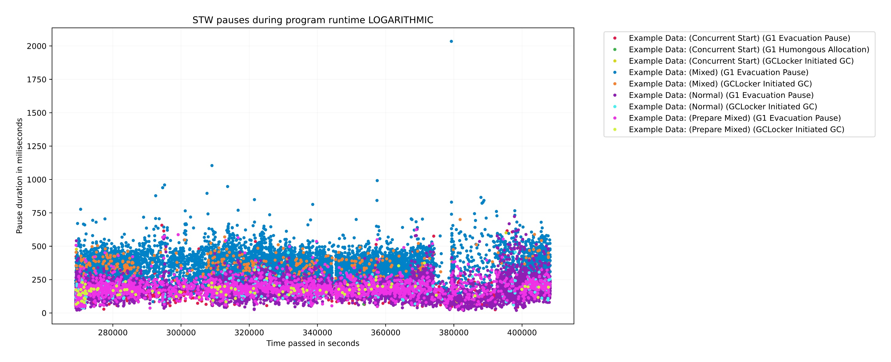

# GCGC :  Garbage Collection Graph Collector 

# Features
This tool enables analysis of gc log files in a Jupyter notebook interface. Allows for comparing multiple log files and or external datasets.

GC information is collected in event logs, which can then be sorted and filtered in both pre-set and adaptable ways.
 
There are 17 generated plots, which analyze latency, concurrent and stw events, heap information, allocation rates, trends, and frequencies of events plotted onto customizable charts and tables. 

Furthermore, using Jupyter notebook for analysis allows for re-running analysis with minor changes to plots, and enables users to apply data transformations during analysis.

Currently supports collectors in both JDK11 & JDK 16.
 # Requirements

- Python3 
- The following Python3 packages
    - numpy
    - pandas
    - matplotlib
    - Jupyter notebook 

Installation explained here:[setup.md](./setup.md)

# How to run analysis

Follow the instructions in [how-to-run.md](how-to-run.md)

Note: Not all files are documented up to date fully:
The following files are still being documented.

- src/parse_log_file.py -> Correct, but improved documentation will be coming soon, to improve experience.
- src/graping/logarithamic_heatmap_testing.py
- src/graphing/allocation_rate.py