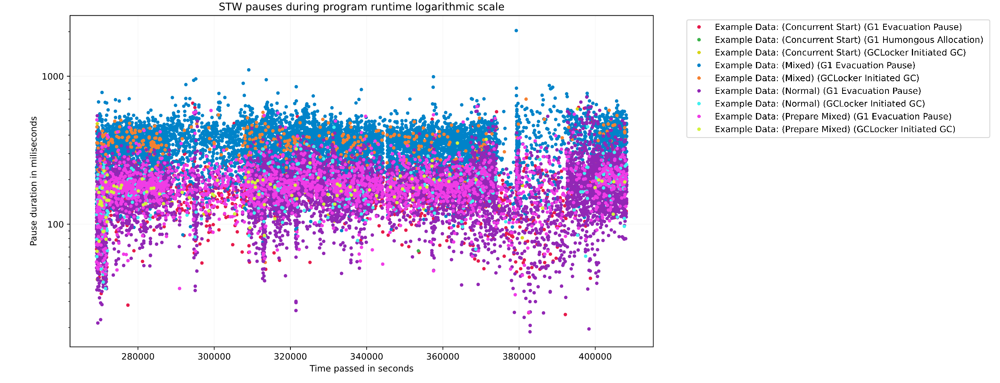
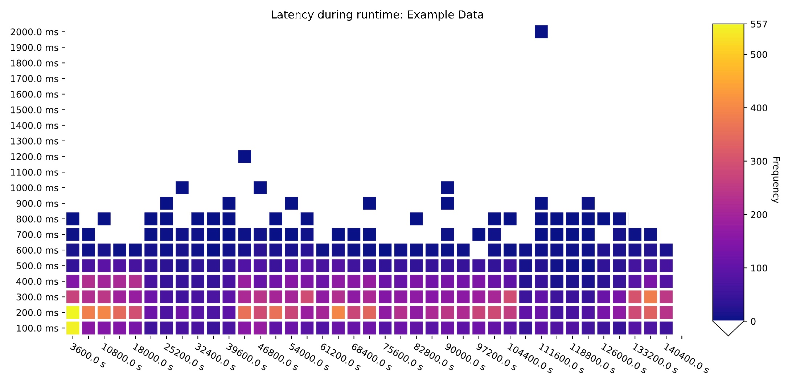

# GCGC :  Garbage Collection Graph Collector 

GCGC uses a Jupyter notebook interface to analyze GC log files.

There are 17 generated plots, which analyze latency, concurrent and STW events, heap information, allocation rates, frequencies of events, and event summaries, comparing any number of log files and external data sources. 
The tool uses Jupyter notebook data visualization allows for easy customization of provided plots.

The analysis is built into a provided notebook, and generates plots and tables from collected GC information. The collected data for each log is parsed into a python pandas 'event log'. Then, using the event logs as a persistent database, the event information can be sorted, filtered, and grouped in both pre-set and customizable ways to display relevant trends and outliers.

Currently supports collectors in JDK11 & JDK 16.
 # Requirements

- Python3 
- The following Python3 packages
    - numpy
    - pandas
    - matplotlib
    - Jupyter notebook 

Installation explained here: [docs/setup.md](./docs/setup.md)

# How to run analysis

Follow the instructions in [docs/how-to-run.md](./docs/how-to-run.md)

--- 

Presentation recording link: [phantom://1fb486cb](phantom://1fb486cb)

## Known edge cases:

Note: The following edge cases are known and not handled automatically:

1) Shenandoah has two phases per garbage collection cycle reporting Heap allocation, will lead to two plotted heap occupancy metrics for each GC phase.
2) ZGC in JDK16 Puts information in safepoints, does not automatically print these in log analysis as it currently stands. These safepoints have comparable metrics to pause times, but ZGC does not report them in the same fashion, so these must be manually enabled on plots.
3) ZGC bytes reclaimed calculation (This may extend to Shenandoah) may be negative, if the rate of allocation exceeds the rate of gc collection. Information is correctly provided in logs, not properly analyzed here. Feature is being fixed in a later version, see issue #61
4) Trying to plot a graph or plot with a returned matlpotlib.axes variable declared in another cell does not show up inline in Jupyter notebooks. 

--- 

## Generating a log file

Creating a log file is quite easy, just add these logging flags to your appllication. 

    -Xlog:gc*:./filename.log

More detailed logging can be added, but the tool should be able to handle the gc log reported using the above Java runtime flags.

