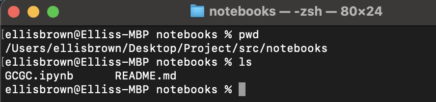
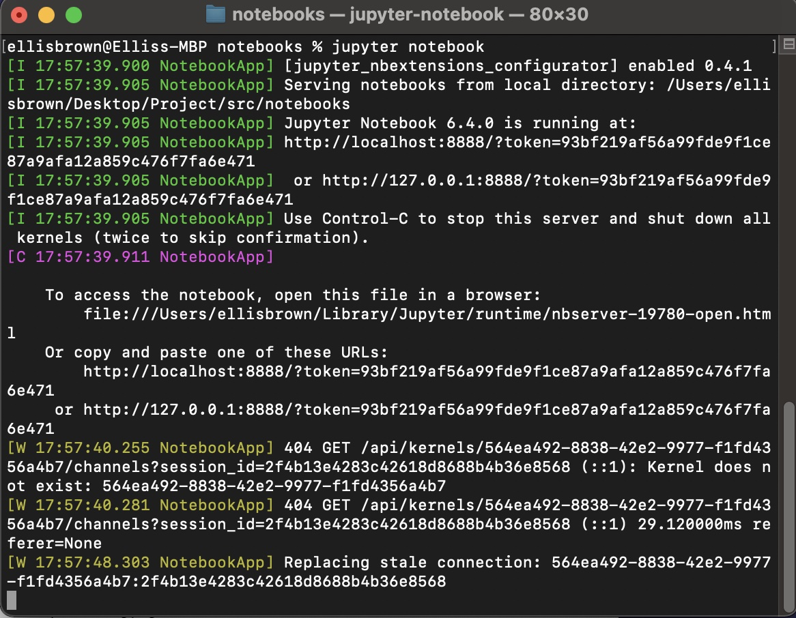
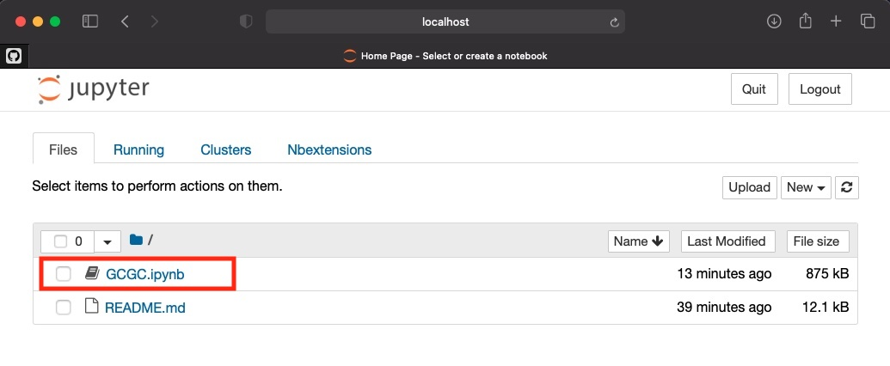
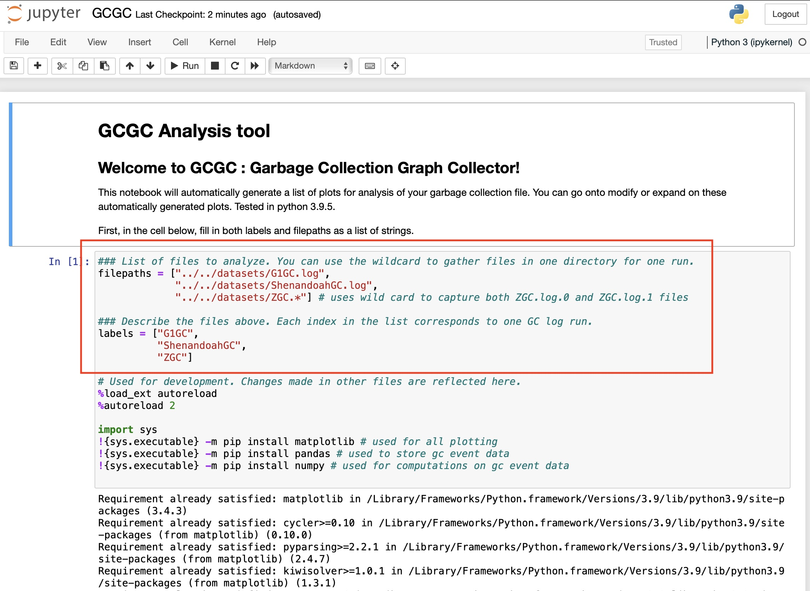
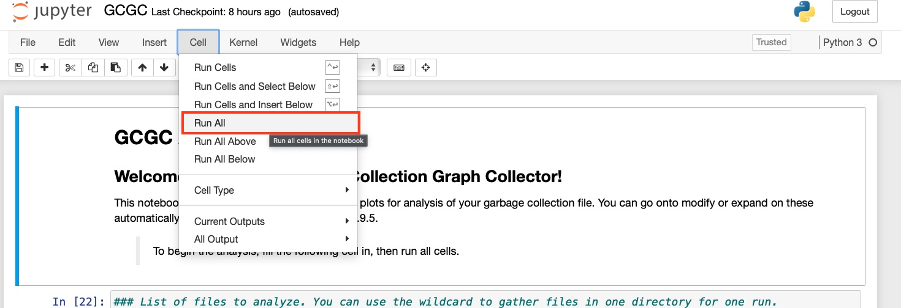
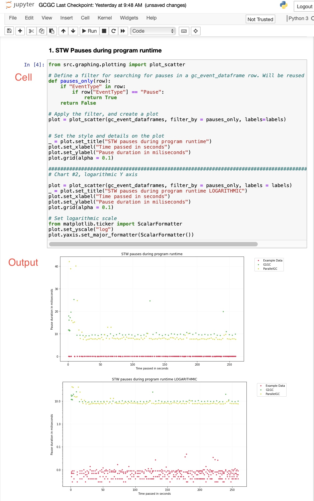
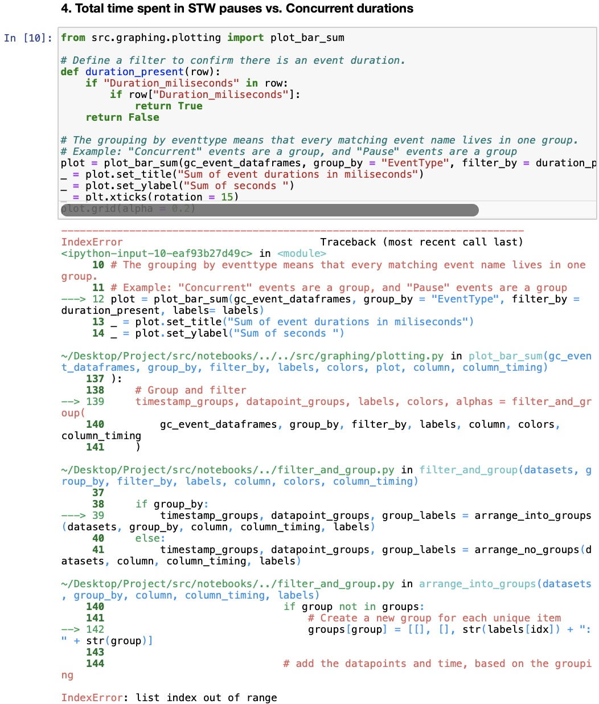
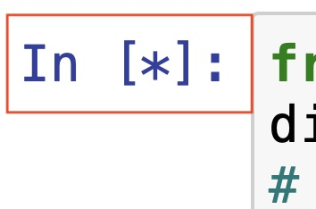
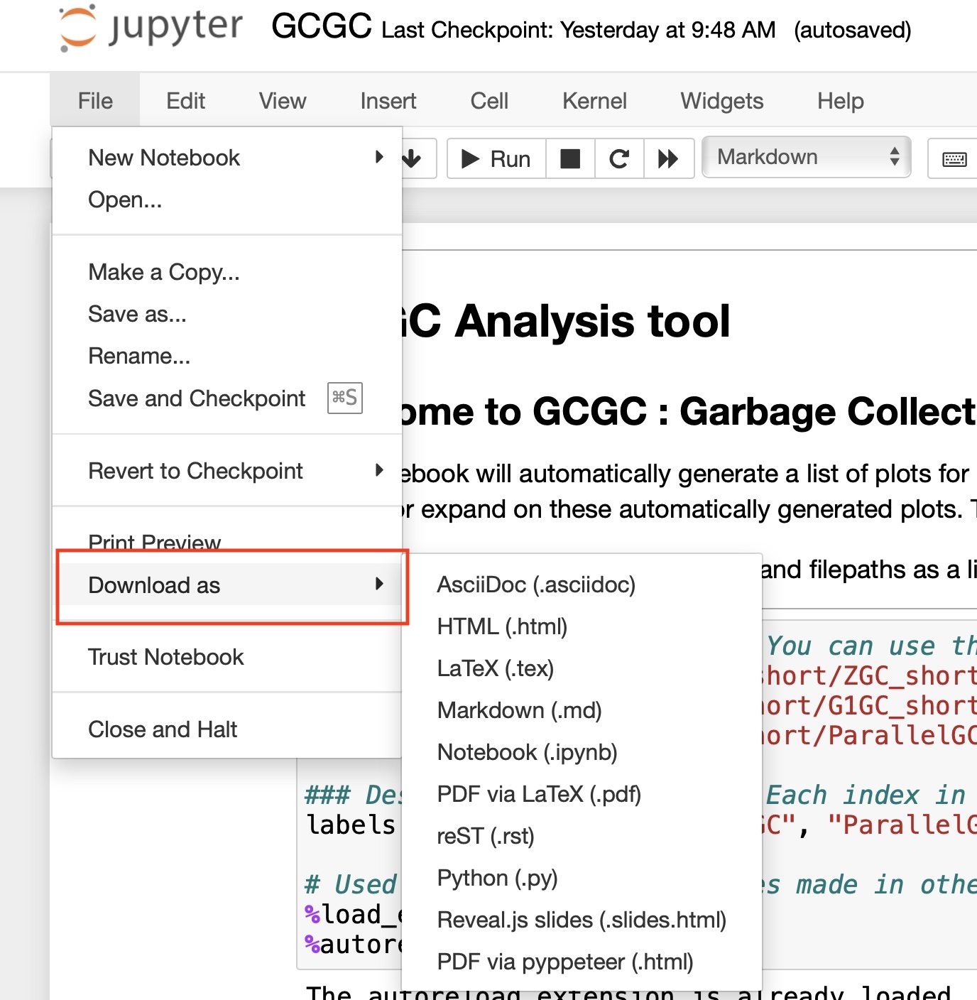

# How to run analysis

 It is expected that you are familiar with Jupyter notebooks. If not, please read this brief explanation from the official documentation: [Explanation](https://notebooks.gesis.org/binder/jupyter/user/ipython-ipython-in-depth-nvzdsac6/notebooks/examples/Notebook/Notebook%20Basics.ipynb)

1. Open up a terminal window, and navigate to `src/notebooks` in a clone of this GCGC tool.

--- 

2. Run the terminal command `jupyter notebook` under [src/notebooks](./src/notebooks). This will begin a python3 kernel for the notebook. It will also open a web page in your default browser. The terminal output should be similar to this one below after a successful launch of the notebook kernel:

---

3. Open the [GCGC.ipynb](./src/notebooks/GCGC.ipynb) notebook in the web page that opened as a result of running the above command. 

---

4. Set the first code cell's required state information. There will be an example already filled out. If this is your first time using the notebook, it is recommended you follow the reamining steps before using your own log files.
   - `filepaths` : a list of log files to be analyzed
   - `labels`: describe the log files listed above. 

In the example below, you can see filepaths to sample data, with labels describing the log files. 

---

5. Run all cells. In the web based Jupyter notebooks, press `Cell` from the top menu, and select `Run All`.  

--- 

6. After pressing `run all`, the GCGC notebook analysis will be generated. The plots will generate one by one starting from the top of the notebook. Each plot takes a few seconds to generate, and may take longer for larger source log files. While cells are running, your screen may jump to the cell that is executing, or jump around in the notebook. This behavior is expected, and will not persist after analysis is complete.

Notice, your cell's output has automatically been plotted inline. Wait for the full notebook analysis to finish, then analyze your results. 
> Warning: An Error caused by a plot will prevent the following cells from executing.  Here is an example of an error message. If you find an error, such as this one caused by failing to put the correct number of labels for the provided files, try to resolve the error by reading all output messages from the top of the file downwards first. For this particular example, you would have found a cell outputting the message "Error: Labels do not have same length as collected data" in a cell above the runtime error.

> 

---

7. Wait for all cells to finish running.

A cell that is running will have the term `In [ * ] :`

A cell that is finished running will have `In [ n ] :`, meaning that the cell was the n-th cell to be run.

---

8. Now that the plots have been generated, scroll through the Jupyter to see the analysis. It is possible to download the notebook to be shared in different formats, as seen below:

Feel free to change any parameter and re-run analysis as needed.