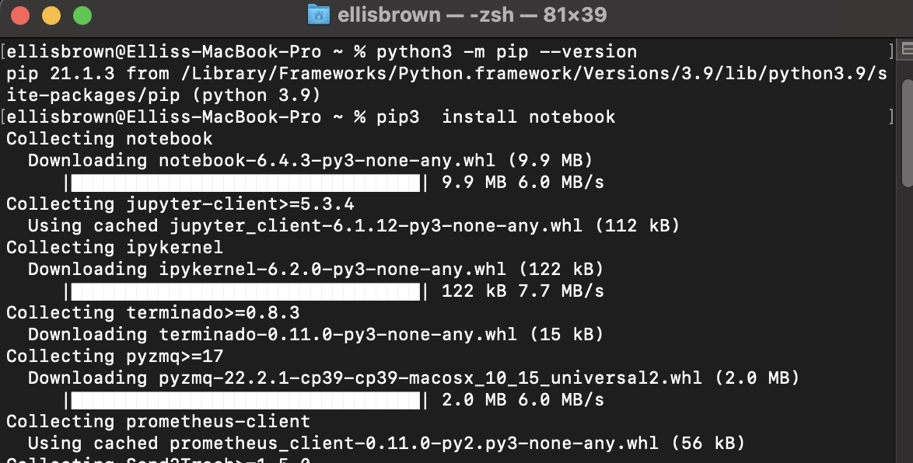

# Setup

This section explains how to locally install python3, jupyter notebook, and other needed python packages (such as matplotlib). Explanation assumes you are running macOS locally on BigSur. MacOS comes with python2 locally installed by default, but it is required to also install python3 for this tool.

---

## Part 0 - Download this repository
The project repository must be downloaded locally to run analyisis, and complete the setup tutorial. Download a local copy of this project by using the command  `git clone <repository>`.

--- 

## Part 1 - Python 3
The official documentation can be found here:  [Python setup MacOS](https://docs.python.org/3/using/mac.html)
However, you are welcome to follow this guide.
> Important notice from official documentation: 
>
> The Apple-provided build of Python is installed in `/System/Library/Frameworks/Python.framework` and `/usr/bin/python`, respectively. You should never modify or delete these, as they are Apple-controlled and are used by Apple- or third-party software. Remember that if you choose to install a newer Python version from python.org, you will have two different but functional Python installations on your computer, so it will be important that your paths and usages are consistent with what you want to do.

1. Open the [Python download page](https://www.python.org/downloads/mac-osx/), and download the latest Python 3 Release
    - Navigate to the latest version, and download "macOS 64-bit universal2 installer" from the files section at the bottom of the download page.
2. Open the python-3.x.x-macos.pkg file you have installed. Follow the installation instructions in the installer application. (Feel free to move the installer to the garbage after installation)
3. Open a terminal , and verify you successfully installed python3, and the the correct version is on path by running `python3 --version`. Confirm the output matches your expected version, such as  `Python 3.9.6`
4. (If step 3 did not work) : Navigate to the Python3.x folder in your `Applications` folder. Open the folder, and run the following program: `Update Shell Profile.command` and `Install Certificates.command`.
5. Repeat step 3. If lost, follow the official documentation for more setup guidance and troubleshooting

---

## Part 2 - Jupyter notebooks
You can find the official documentation on how to install Jupyter notebooks [here](https://jupyter.org/install)

1. Use pip package manager to install packages. Confirm the correct installation of the pip package manager using `python3 -m pip --version`

- Note:  You may need to update the pip3 version. If given one, follow the command line warning to update the version by running the command (`python3 -m pip install --upgrade pip`). Otherwise, follow [this guide](https://packaging.python.org/tutorials/installing-packages/) in the offical python documentation 
 
2. Type the command `pip3 install notebook` to install the Jupyter notebook package. Your output should be similar to this one here:

    

Now, we will confirm Jupyter notebooks has been installed correctly.

1. run the command `jupyter notebook` in terminal to launch a local notebook server. The terminal can be in any directory when this command is run, but it is recommended you navigate to a new directory first. This should cause your default web browser to open to a locally hosted notebooks server. A more detailed explanation of this step can be found in [how-to-run.md](./how-to-run.md) steps 1-3.
If the web page has opened correctly, then the package has been successfully installed.

If there are any issues installing and opening Jupyter notebooks, follow the [official documentation](https://jupyter.org/install) for more guidance.

After completing setup, continue onto [how-to-run.md](./how-to-run.md) to begin log analysis.

> Note: You can use some IDEs to edit and run your Jupyter-notebook, if desired. One example is Visual Studio Code, which lets you modifiy and run the notebook in the IDE. However, all documentation in this project expects you to be using web based Jupyter notebooks