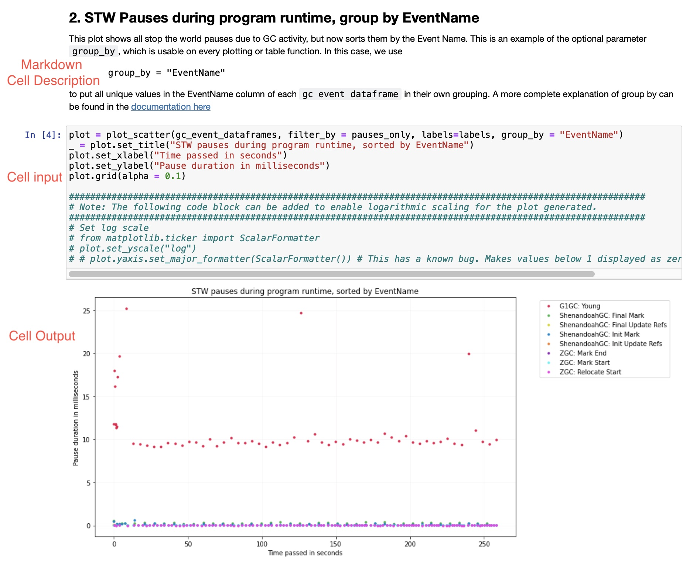

# How to run analysis

### 1. Open up a terminal window, and navigate to `src/notebooks` in this GCGC tool.

--- 

### 2. Run the terminal command `jupyter notebook` under [src/notebooks](./src/notebooks). This will begin a python3 kernel to execute commands. It will also open a web page in your default browser. The terminal output contains information on how to open the correct web page if it d

---

### 3. Open [GCGC.ipynb](./src/notebooks/GCGC.ipynb) in the web page that opened as a result of running the above command. If using an IDE, open the file from [src/notebooks](src/notebooks)

---

### 4. Set the second code cell's required state information. There will be an example already filled out.
   - `filepaths` : a list of log files to be analyzed
   - `labels`: describe the log files listed above. 

---

### 5. Run all cells. In the web based Jupyter notebooks, press `Cell` from the top menu, and select `Run All`. If you are working from an IDE rather than web based Jupyter, follow the online documentation for your particular IDE.  

--- 

### 6. After that, the analysis should be automatically generated! To view the analysis, the plots will generate one by one starting from the top of the file. After running all cells, scroll down to verify they have begun to run.

Notice, your cell's output has automatically been plotted inline. Wait for the full notebook analysis to finish, then analyze your results. Warning: An Error caused by a plot will prevent the following cells from executing. 

---

### 7. Wait for all cells to finish running.

A cell that is running will have the term In [ * ] :

A cell that is finished running will have In [ n ]:  meaning that the cell was the n-th cell to be run.

Example for order of cells run: Running the same cell, which starts with value N, 10 times, will result in the same cell displaying (N + 10) as a result. Running X cells once each, starting at 1, will display the numbers 1...X on the cells sequentially.